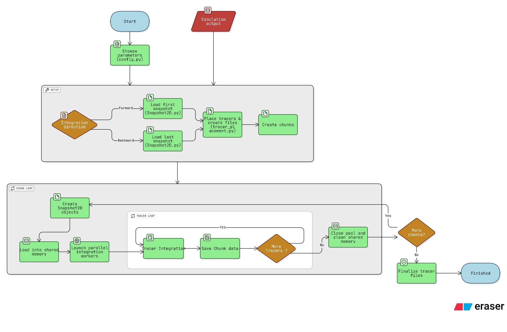

# 2-D FLASH Tracer Integration

Author: Benedikt Weinhold (~Oct 2025)  
Description: Python pipeline for placing and integrating Lagrangian tracer particles through 2D axisymmetric FLASH supernova simulations.  

## Disclaimer
  -  This is work in progress until i finish my master thesis end of 2025. The most up to date version will be in the NewBranch branch
---

## Aims
  - This  Repository includes a Pipeline to integrate the path of *Lagrangian Tracer Particles* throughout a 2D astrophysical simulation from the output snapshots,
      all while saving the thermodynamic conditions ('temp', 'dens', 'ye', ...) in order to do a full post-processing nucleosynthesis analysis with a nuclear reaction network.
  - The format of the output files is made as an input for the open source nuclear reaction network WinNet (https://github.com/nuc-astro/WinNet), but can be easily modified to the input format of other nuclear reaction networks in tracer_files.py
  - The code is developed and tested for tracers in core collapse supernovae, but can in principle be used for any hydro-output regardless of the simulated event
  - As is, the code can read  and process the snapshots/plotfiles from the Hydro-Code FLASH but without much work this can be adjusted for ANY simulation code
     (more on that in the section *Snapshot2D class*)
  - There are some jupyter notebooks with elementary nucleosynthesis analysis added, these expect the nucleosynthesis calculation to be done with WinNet.

---

## Features

- **Tracer Placement**  
  - Place tracers based on density and Ye deviations.  
  - Supports increasing tracer density in regions where `|Ye - 0.5| > 0.02` .  

- **Tracer Integration**  
  - Integrates tracers through the FLASH velocity field interpolating both in space between cells and in time between snapshots.  
  - Supports forward and backward time integration with boundary checks and event termination (OOB, NSE).  
  - Parallelized with Python multiprocessing.  

- **Flexible File Read-in**
  - easy to modify to the output of other simulation codes
  - stores Snapshots in *python.multiprocessing.shared_memory* to allow for huge simulation output files (i.e. when generalizing to 3D simulations)

- **Output Handling**  
  - Writes tracer positions and thermodynamic histories to text files.  
  - Handles multiple chunks and large numbers of tracers efficiently.  

---

## Requirements

- Python 3.10+  
- NumPy  
- SciPy  
- Multiprocessing  
- HDF5 reading library (e.g., `h5py` if needed by `Snapshot2D`)  

---

## Repository Structure
```
Tracers/
├── main.py # Main execution script
├── config.py # User-configurable parameters
├── src/
│ ├── init.py
│ ├── utils.py # Utility functions (logging, etc.)
│ ├── tracer_files.py # File handling for tracer output
│ ├── tracer_placement.py # Functions for placing tracers in snapshots
│ ├── tracer_integration.py # Integration routines (solve_ivp-based)
│ ├── Snapshot2D.py # FLASH snapshot reading and handling
│ └── Progenitors.py # Progenitor-specific input handling
├── README.md # This file
└── basic_nuclear_analysis(soon)
```
---

##  Workflow



## Usage

1. **Configure parameters** in `config.py`, including:
   - Snapshot directory
   - Number of tracers
   - Integration settings
   - Output directory  

2. **Run the program** via SLURM or locally:
```bash
python main.py
```
3. Monitor progress through log file run.log.

---
## List of Parameters

All parameters are configured in `config.py` before running the integration.

### File Paths
| Parameter | Type | Description |
|-----------|------|-------------|
| `PATH_TO_PLTFILES` | str | Path to (FLASH) plotfiles/snapshots|
| `PATH_TO_OUTPUT` | str | Directory where tracer output files will be written |
| `PATH_TO_PROGFILE` | str | Path to progenitor model file for initial composition |
| `PATH_TO_TRACERS_START` | str | Path to file containing initial tracer positions (when `PLACEMENT_METHOD='FromFile'`) |

### Simulation Selection
| Parameter | Type | Description |
|-----------|------|-------------|
| `PLT_FILES` | list | Sorted list of snapshot files to process (can be sliced, e.g., `[:793]` for first 793 files) |
| `ARB_MESSAGE` | str | Arbitrary message written to `run.log` for identifying this run |
| `INPUT_FILE` | str | 'FLASH' or other implemented simulation output (must be implemented in Snapshot) |

### Integration Settings
| Parameter | Type | Default | Description |
|-----------|------|---------|-------------|
| `DIRECTION` | str | - | Time direction of integration: `'forward'` or `'backward'` |
| `CHUNK_SIZE` | int | - | Number of snapshots to load and process at once (memory management) |
| `RTOL` | float | 1e-2 | Relative tolerance for `solve_ivp` ODE integrator |
| `ATOL` | float | 1e4 | Absolute tolerance for `solve_ivp` ODE integrator |
| `MAXSTEP` | float | 1e-4 | Maximum timestep size for `solve_ivp` integrator |
| `TIME_LIMIT` | float | 6000.0 | Maximum integration time per tracer (seconds) to prevent stalling (adjust with `CHUNK_SIZE`) |

### Physics Options
| Parameter | Type | Default | Description |
|-----------|------|---------|-------------|
| `WITH_NEUTRINOS` | bool | True | If True, also stores neutrino luminosity and mean energy in tracer files |
| `ONLY_UNTIL_MAXTEMP` | bool | False | If True (backward integration), stops integration when tracer reaches `MAXTEMP_TRACER` |
| `MAXTEMP_TRACER` | float | 1e10 | Temperature threshold (K) for stopping backward integration when `ONLY_UNTIL_MAXTEMP=True` |
| `NSE_TEMP` | float | 5.8e9 | Nuclear Statistical Equilibrium temperature (K); noted in header if tracer reaches this temperature |

### Tracer Placement
| Parameter | Type | Default | Description |
|-----------|------|---------|-------------|
| `PLACEMENT_METHOD` | str | - | Method for placing tracers: `'PosWithDens'` (automatic placement) or `'FromFile'` (read from file) |
| `NUM_TRACERS` | int | 1000 | Number of tracers to place (when `PLACEMENT_METHOD='PosWithDens'`) |
| `ONLY_UNBOUND` | bool | True | If True, only place tracers in unbound/ejected material (when `PLACEMENT_METHOD='PosWithDens'`) |
| `MAX_TEMP_PLACE` | float | 1e10 | Maximum temperature (K) for tracer placement in backward integration |
| `MAX_DENS` | float | 1e11 | Maximum density (g/cm³) for tracer placement; prevents placing tracers in proto-neutron star when `ONLY_UNBOUND=False` |

### Output Options
| Parameter | Type | Default | Description |
|-----------|------|---------|-------------|
| `WITH_T_EVAL` | bool | True | If True, uses `t_eval` in `solve_ivp` to output at snapshot times; if False, uses internal adaptive timesteps |

### Progenitor Settings
| Parameter | Type | Default | Description |
|-----------|------|---------|-------------|
| `CALC_SEEDS` | bool | True | If True, calculates initial composition of tracers from progenitor file |
| `PROG_TYPE` | str | 'NuGrid' | Type/format of progenitor file (must be implemented in `progenitors.py`) |

### Domain Bounds
| Parameter | Type | Description |
|-----------|------|-------------|
| `XMIN` | float | Minimum radial coordinate (cm) for computational domain |
| `XMAX` | float | Maximum radial coordinate (cm) for computational domain |
| `YMIN` | float | Minimum z-coordinate (cm) for computational domain |
| `YMAX` | float | Maximum z-coordinate (cm) for computational domain |

### Notes on Key Parameters

**Integration Tolerances (`RTOL`, `ATOL`, `MAXSTEP`):**
- These control the accuracy and step size of the ODE solver
- Smaller values = higher accuracy but slower computation
- For hydrodynamic flows, typical values: `RTOL=1e-3` to `1e-2`, `ATOL=1e3` to `1e5`

**Chunk Size:**
- Larger chunks = fewer I/O operations but more memory usage
- Adjust based on available RAM and snapshot file sizes
- For 2D simulations: 500-2000 snapshots per chunk is typical

**Temperature Thresholds:**
- `NSE_TEMP`: Nuclear Statistical Equilibrium typically occurs at T > 5×10⁹ K
- `MAXTEMP_TRACER`: Used to stop backward integration before numerical issues arise

**Placement Methods:**
- `'PosWithDens'`: Automatically places tracers based on density and Ye distributions
- `'FromFile'`: Reads pre-defined tracer positions from a file (useful for targeted studies)
---
## Snapshot2D Class
  -  Snapshot class is the interface between the tracer code and the simulation output file
  -  Snapshot2DFLASH is implemented and can be used as a template for other input files
  -  Snapshot2DBase(ABC) shows the needed attributes and functions the user has to add in case of another code output
    - Pre-implemented shared memory functions (from_shm is constructor from shm)
  -  General workflow:
    - Opens the (hdf5)-file
    - Saves relevant information as attributes, including td_vars which holds thermodynamic (and neutrino-) information
    - needs: getQuantAtPos which interpolates the given quantity in td_vars from cell centers to the given position
  - Needed functions/properties:
    - for block based placement: 
      - self.bbox, self.cells_per_block_x, self.cells_per_block_y, def cellCoords(self, blockID), def cellCoords(self, blockID)
    - for tracer integration in general:
      - see abstractmethods and properties of Snapshot2DBase in Snapshots.py 
---
## Progenitor Class
  - Progenitor class is the interface between the tracer code and the progenitor file from the given simulation
  - only needed if calc_seeds = True
  - reads in progenitor composition and calculates the composition for a given radius
  - 'NuGrid' (Nugrid output) and 'FLASH' (FLASH input) are already implemented and can be used as a reference
---

## Placement 
  - Implemented placement options: 'FromFile' and 'PosWithDens'
  - if 'FromFile': need to set parameter: 'PATH_TO_TRACERS_START' with columns x, y, M_tr
  - if 'PosWithDens', calls PosFromDens_blockbased which loops over blocks and sets tracers according to NUM_TRACERS, ONLY_UNBOUND, MAX_TEMP_PLACE, YE_STEPS, MAX_DENS_PLACE
    - if ONLY_UNBOUND = 'False': only exclude areas with dens > MAX_DENS_PLACE and T > MAX_TEMP_PLACE, place tracers everywhere else
    - if ONLY_UNBOUND = 'True': only place tracers in cells with v_rad > 0 (outwards moving) and gpot+ener > 0 (gravitationally unbound) and T < MAX_TEMP_PLACE
    - general workflow:
      - loop over all blocks, check for cells according to the given criterion (only unbound or with max dens) and save them, add up the mass from those cells
      - second loop over the blocks, check how much tracers per block by comparing overall amount of mass with mass per block and tracers to place
      - IF YE_STEPS = 'True' stepwise increasement of tracers to place per block, if Ye deviation enough
      - mass per tracer: M_block_crit/N_tracer_per_block
      - if td_vars keys are different for another code, you have to adjust this function
---
## Citation

No citation is required, but an acknowledgement is appreciated (Also because im interested in your results :))
