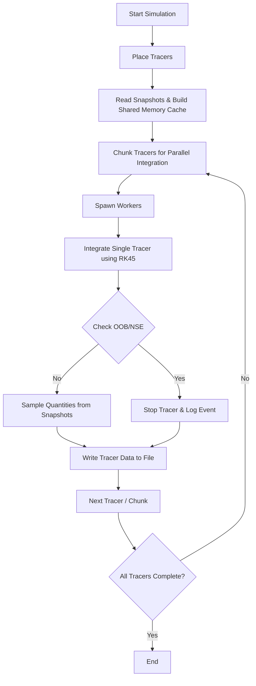

# 2-D FLASH Tracer Integration (Shared-Memory Cache Edition)

Author: Benedikt Weinhold (~Sep 2025)

## Overview

This repository contains a Python code to integrate Lagrangian tracer particles through 2-D FLASH hydrodynamical simulation snapshots. The integration uses an adaptive Runge-Kutta (RK45) scheme in time with interpolation between snapshots and cell centers in space. The code is designed to be efficient and scalable using shared-memory parallelization, reducing unnecessary I/O operations.

The main purpose of the code is to track the thermodynamical history of tracer particles, enabling post-processing nucleosynthesis analyses with nuclear reaction networks.

---

## Workflow

1. **Tracer Placement**
   - Tracer particles are placed according to cell mass and optionally enhanced in regions with Ye deviations.
   - Placement can be done either from a file or based on cell density.

2. **Snapshot Reading & Shared-Memory Cache**
   - Simulation snapshots (HDF5 files) are read and loaded into a shared-memory cache.
   - The cache is then accessed by all worker processes to avoid redundant file I/O.

3. **Tracer Integration**
   - Each tracer is integrated individually using `solve_ivp` with RK45.
   - Velocity fields are interpolated in time between snapshots and in space at cell centers.
   - Out-of-bound (OOB) events and NSE (nuclear statistical equilibrium) flags are tracked.

4. **Output**
   - Trajectory data for each tracer is written to individual files.
   - Data includes positions, velocities, densities, temperatures, neutrino fluxes, and other relevant quantities.

---

## Dependencies

- Python 3.x
- numpy
- scipy
- h5py
- astropy
- multiprocessing (standard library)
- Snapshot2dFLASH.py (custom module)
- Progenitors.py (custom module)
- flash_shared_cache.py (custom module)

---

## Parallelization & Shared Memory

- The code uses Python `multiprocessing` with the `spawn` start method to ensure cluster safety.
- A shared-memory cache stores simulation snapshots, accessible to all workers.
- Each chunk of tracers is processed in parallel, with each worker reading from shared memory instead of performing repeated file I/O.
- Shared arrays (`Manager.Array`) track tracer states, NSE flags, and integration progress across processes.

**Benefits:**
- Reduces memory footprint.
- Avoids unnecessary file reading.
- Allows scalable parallel execution on HPC clusters.

---

## Integration Mechanism

- Integration is performed via `scipy.integrate.solve_ivp` with the `RK45` method.
- Interpolation in **time** is performed between two nearest snapshots.
- Interpolation in **space** is performed using cell-centered data from FLASH.
- Events like out-of-bound particles terminate the integration.
- Backward or forward integration is supported.

### Diagram of Workflow



---

## Running the Code

1. Configure the global parameters at the top of the script, e.g., paths, number of tracers, physics switches.
2. Ensure all dependencies and custom modules (`Snapshot2dFLASH.py`, `Progenitors.py`, `flash_shared_cache.py`) are in the Python path.
3. Execute the main script with Python 3:

```bash
python3 2D_FLASH_tracer_integration.py
```

4. Monitor `run.log` in the output directory for progress and events.

---

## Parameters

Below is a list of parameters defined at the top of the code. Fill in the descriptions as needed:

| Parameter | Description |
|-----------|-------------|
| path_to_pltfiles | |
| plt_files | |
| path_to_tracers | |
| with_neutrinos | |
| only_until_maxTemp | |
| maxTemp_tracer | |
| NSE_temp | |
| calc_seeds | |
| prog_type | |
| path_to_progfile | |
| direction | |
| placement_method | |
| maxTemp_placement | |
| path_to_tracer_start | |
| num_tracers | |
| only_unbound | |
| max_dens | |
| arb_message | |
| chunk_size | |
| rtol | |
| atol | |
| maxstep | |
| PER_TRACER_TIMEOUT | |
| xmin | |
| xmax | |
| ymin | |
| ymax | |
| solve_ivp_args | |
| keys | |
| tracer_entries | |
| tracer_entries_units | |
| tracer_entries_fmt | |
| num_cpus | |

